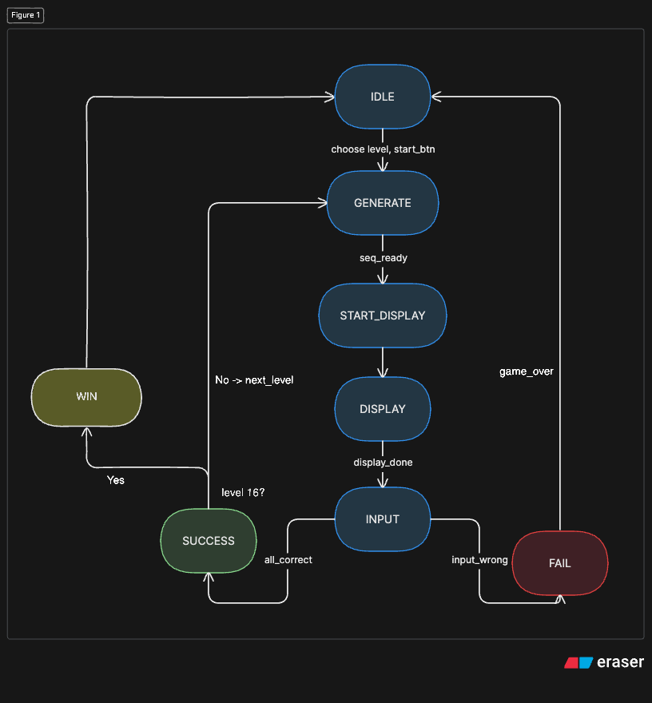

# Simon Says FPGA Game

A hardware implementation of the classic **Simon Says memory game** built in **Verilog** on a **Nexys FPGA board** using a modular finite state machine (FSM) architecture.

The system generates pseudo-random LED sequences, displays them to the player, accepts user input through buttons, and verifies correctness in real time. The project emphasizes modular digital design, synchronization, FSM control logic, and hardware debugging.

---

# Demo Features

- 🎮 Fully playable Simon Says game on FPGA
- 🧠 FSM-controlled gameplay
- 🔀 Pseudo-random sequence generation using LFSR
- 💾 Memory-based sequence storage
- 🔁 Dual memory read paths for:
  - LED display
  - User input validation
- 🎚 Start from any level using FPGA switches
- 💡 LED OFF phase between flashes to distinguish repeated LEDs
- 🔢 Seven-segment display for:
  - current level
  - `LOSE`
  - `PASS`
- ⏱ Human-visible timing using clock-enable tick generator
- 🧩 Fully modular architecture

---

# Gameplay Flow

1. User selects starting level using board switches
2. User presses start button
3. FSM generates a random sequence
4. Sequence player displays LEDs
5. User repeats sequence using buttons
6. FSM validates user input one step at a time
7. Correct input:
   - level increases
   - new sequence generated
8. Wrong input:
   - display shows `LOSE`
   - returns to idle
9. Completing level 16:
   - display shows `PASS`
   - returns to idle

---

# Finite State Machine

The FSM controls the entire game progression and synchronization between modules.



### FSM States

| State | Purpose |
|---|---|
| `IDLE` | Wait for user to select level and press start |
| `GENERATE` | Fill sequence memory with random values |
| `START_DISPLAY` | Pulse sequence player start signal |
| `DISPLAY` | Show LED sequence to player |
| `INPUT` | Accept and validate user input |
| `SUCCESS` | Advance level |
| `FAIL` | Show `LOSE` and reset |
| `WIN` | Show `PASS` after level 16 |

---

# Project Architecture

## Top-Level Modules

| Module | Purpose |
|---|---|
| `simon_says_top.v` | Top-level integration |
| `fsm_controller.v` | Main game control logic |
| `sequence_mem.v` | Stores generated sequence |
| `sequence_player.v` | Displays LED sequence |
| `input_handler.v` | Encodes user button presses |
| `debounce.v` | Removes noisy button bouncing |
| `lfsr_random.v` | Generates pseudo-random values |
| `tick_generator.v` | Creates slower timing pulse |
| `seven_seg_driver.v` | Controls seven-segment display |

---

# Sequence Memory Design

The sequence is stored in a memory array:

```verilog
reg [1:0] memory [0:15];
```

Each memory entry stores one 2-bit value corresponding to an LED/button pair.

### LED/Button Encoding

| Value | LED/Button |
|---|---|
| `00` | LED0 / BTN0 |
| `01` | LED1 / BTN1 |
| `10` | LED2 / BTN2 |
| `11` | LED3 / BTN3 |

---

# Dual Read Path Architecture

One of the main design features is the use of **two independent memory read addresses**:

- `player_addr`
  - controlled by `sequence_player`
  - used for LED display

- `input_index`
  - controlled by FSM
  - used for user input verification

This separation prevents synchronization conflicts and eliminated off-by-one comparison bugs encountered during development.

---

# Starting Level Selection

The FPGA switches allow the user to start at any level from 1–16.

### Example

| Switch | Starting Level |
|---|---|
| `SW0` | Level 1 |
| `SW7` | Level 8 |
| `SW15` | Level 16 |

This feature makes debugging and gameplay testing significantly easier.

---

# LED Timing Design

The sequence player includes an OFF phase between LED flashes:

```text
LED ON → OFF → NEXT LED
```

This allows repeated LED values to remain visually distinguishable.

Example:

```text
LED2 → OFF → LED2
```

instead of appearing as one long flash.

---

# Seven-Segment Display

The seven-segment display supports three modes:

| Mode | Display |
|---|---|
| Gameplay | Current Level |
| Failure | `LOSE` |
| Victory | `PASS` |

The display uses:
- active-low segment control
- multiplexed digit refreshing

---

# Technical Challenges

Some major challenges encountered during development:

- Display Sequence and Memory Mismatches
- Sequence Generation and Storage
- Generated clock/tick timing issues
- Synchronizing FSM timing across modules
- Debugging Hardware Behaviors with Waveforms


### Solutions

- Dual-address memory architecture
- Enable signal to capture and store a continously, randomly generated sequence
- Clock-enable tick generator
- Modular testing and simulation
- FSM redesign

---

# Technologies Used

- Verilog HDL
- Vivado
- Nexys FPGA Board
- Finite State Machines
- Seven-Segment Multiplexing
- Memory Arrays
- FPGA Synthesis & Timing Analysis

---

# Authors

**Bao Nguyen**  
**Benjamin Gonzalez**

Boston University — EC311 Logic Design
